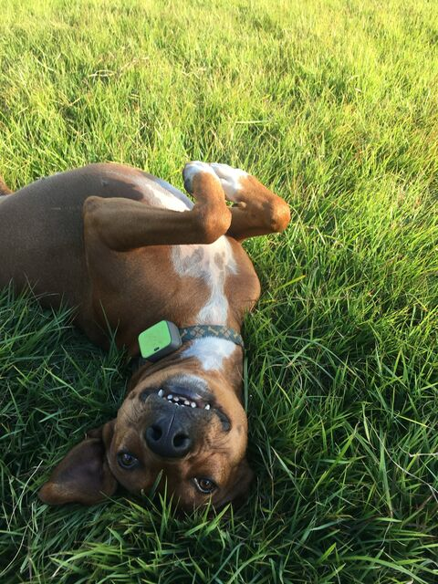

# Leashline

   

## Meet Rufio



This is **Rufio**, our adopted (ex-)hunting dog. We built Leashline for him.

Rufio has a big heart, and can pass through any fenceline on the planet with ease. He is anxious and driven to escape regarding:

- Thunderstorms
- Fireworks
- Gunshots
- Other loud sounds
- Quiet electronic sounds (yes, really)
- The sight of suitcases
- Separation
- Vibes (unspecified)

And sometimes, he escapes for the joy of it.

We live in a low-signal cellular area, so when Rufio escapes, commercial GPS trackers (Fi, Whistle, Halo) can take **hours** to deliver a location update. By then he's three counties over making friends.

Leashline uses **LoRa radio** instead of cellular — long range, no towers needed, real-time positions even in the middle of nowhere. If Rufio crosses a geofence boundary, we know in seconds, not hours.

If you have a dog like Rufio and like to tinker, we'd love to have you join our quest for better pet tracking!

<br clear="right" />

---

Leashline is a **dog escape detection system** using LoRa/Meshtastic radio tracking with polygon geofencing. GPS collars transmit positions over LoRa to a base station hub, which relays data to the Leashline API via WiFi (at home) or BLE (on the go). The API runs escape detection, stores positions, and streams real-time alerts to a PWA frontend.

Multi-user support via Clerk auth and "packs" (households) — each pack gets its own MQTT topic namespace, so multiple families can use the same deployment.

**Status:** early alpha.

## How It Works

```
Dog collar (LoRa GPS)
    │ LoRa radio
    ▼
WiFi hub (at home)  ──WiFi──>  Cloud MQTT broker
  or                              │
BLE hub (on the go) ──phone──>    │
                                  ▼
                          Leashline API
                    (subscribes to pack topics)
                       │          │          │
                   Geofence    Escape     SSE stream
                    check     detection   to frontend
                                              │
                                     PWA (map, alerts,
                                     tracking, pack mgmt)
```

1. A Meshtastic GPS collar broadcasts position packets over LoRa
2. A base station hub receives them and publishes to MQTT (via WiFi or phone BLE bridge)
3. The API subscribes to `leashline/{pack_id}/2/json/#` and parses track points
4. The detection engine checks each point against polygon geofences
5. Alerts fire on boundary approach, breach, confirmed escape, and return
6. Positions and alerts stream to the web frontend via SSE

## Requirements

- Python >= 3.11
- [uv](https://docs.astral.sh/uv/) package manager
- Node.js >= 18 (for the web frontend)

## Quick Start

```bash
git clone https://github.com/zgazak/leashline.git
cd leashline
make sync           # install Python dependencies
make run            # API on http://localhost:8000 (no auth by default)

# Frontend
cp web/.env.example web/.env.local
# Edit web/.env.local — add your NEXT_PUBLIC_MAPBOX_TOKEN (free at mapbox.com)
make web-install
make web-dev        # http://localhost:3000
```

For full setup instructions — local MQTT broker, cloud MQTT (EMQX Serverless), AWS deployment with SST, Clerk auth, and Meshtastic hub configuration — see **[SETUP.md](SETUP.md)**.

## API

| Method | Endpoint | Description |
|--------|----------|-------------|
| GET | `/` | Health check |
| GET/POST/DELETE | `/dogs` | Dog profile CRUD (pack-scoped) |
| GET/POST/DELETE | `/geofences` | Polygon geofence CRUD (pack-scoped) |
| GET | `/positions/latest` | Latest position per device (pack-scoped) |
| GET | `/positions/{device_id}` | Position history (pack-scoped) |
| GET | `/alerts` | List alerts (pack-scoped) |
| POST | `/alerts/{id}/acknowledge` | Acknowledge an alert |
| GET | `/devices` | List known devices (pack-scoped) |
| POST | `/devices/{id}/assign` | Assign a device to a dog |
| GET | `/connection/status` | Current connection state |
| POST | `/connection/switch` | Switch connection type |
| GET | `/connection/scan` | Scan for nearby BLE devices |
| POST | `/packs` | Create a pack (household) |
| GET | `/packs/me` | Get current user's pack + members |
| POST | `/packs/invite` | Generate invite code |
| POST | `/packs/join` | Join pack with invite code |
| DELETE | `/packs/members/{user_id}` | Remove member (owner only) |
| GET | `/stream/positions?token=` | SSE positions (pack-filtered) |
| GET | `/stream/alerts?token=` | SSE alerts (pack-filtered) |
| GET | `/stream/connection?token=` | SSE connection state |

All pack-scoped endpoints require auth (when enabled). SSE endpoints use `?token=` query param since EventSource can't send headers.

## Project Structure

```
leashline/
├── engine/                  # Pure detection algorithms (zero I/O)
│   └── src/engine/
│       ├── models/          # Pydantic v2 data models
│       ├── geo/             # Point-in-polygon, haversine, boundary proximity
│       └── detection/       # Motion, scatter, sampling, escape detection
├── app/                     # FastAPI server
│   └── src/app/
│       ├── api/             # REST + SSE endpoints (pack-scoped)
│       ├── auth/            # Clerk JWT deps (get_current_user, get_pack_id)
│       ├── models/          # App-layer models (Pack, PackMember, PackInvite)
│       ├── core/            # Config, async event bus
│       ├── storage/         # SQLite with TenantRepository (pack_id isolation)
│       ├── listener/        # Meshtastic + MQTT listeners, connection manager
│       └── processor.py     # Detection pipeline (envelope-aware)
├── web/                     # Next.js frontend (PWA)
│   └── src/
│       ├── app/             # App Router pages (incl. sign-in/sign-up)
│       ├── components/      # Map, sidebar, alerts, PackSetup, PackSettings
│       ├── hooks/           # Auth-aware SSE subscription hooks
│       └── lib/             # API client, types, auth provider
├── resources/               # YAML config files
└── leashline/               # PyPI package stub
```

The engine is intentionally pure — no I/O, no database, no network. It takes positions in and returns verdicts out. Pack/tenant isolation lives entirely in the app layer.

## Hardware

### Two-hub setup

| Component | Role | Hardware | Connectivity |
|-----------|------|----------|-------------|
| **Dog collar** | GPS + LoRa transmitter | [Spec5 Trace](https://specfive.com/products/specfive-trace-gps-tracker-for-dogs-teams) (~$130) | LoRa only |
| **WiFi hub** (home) | Always-on base station | Heltec WiFi LoRa 32 V4 (~$20) | LoRa + WiFi → MQTT |
| **BLE hub** (mobile) | Portable for walks/chasing | RAK WisMesh Pocket (~$40) or any Meshtastic node | LoRa + BLE → phone → MQTT |
| **Outdoor antenna** | Improves range | Any 915 MHz omni + SMA coax (~$60–100) | — |

All LoRa devices must be on the same Meshtastic frequency (US915 for North America).

### Dog collar setup (Spec5 Trace or similar)

The collar just broadcasts GPS positions over LoRa — no WiFi, no MQTT, no internet. The base station handles the relay to MQTT.

1. Flash [Meshtastic firmware](https://meshtastic.org/docs/getting-started/flashing-firmware/) (Spec5 Trace ships with it pre-installed)
2. Set the LoRa region: `meshtastic --set lora.region US`
3. **Enable MQTT publishing**: `meshtastic --set lora.config_ok_to_mqtt true` — without this, the base station will hear the collar but won't publish its packets to MQTT
4. Set full position precision on the channel: `meshtastic --ch-set module_settings.position_precision 32 --ch-index 0` — the default (13) truncates GPS to ~400m blocks
5. That's it — unplug and go. The collar broadcasts every 30 seconds when it has a GPS fix

### WiFi hub setup (Heltec WiFi LoRa 32 V4)

The WiFi hub stays at home, connects to your WiFi, and publishes received LoRa positions directly to an MQTT broker — no phone required. Dogs can be home alone and still be tracked. **MQTT Client Proxy: OFF** (device connects directly).

1. Flash [Meshtastic firmware](https://meshtastic.org/docs/getting-started/flashing-firmware/) onto the Heltec V4
2. Configure WiFi: set `network.wifi_ssid` and `network.wifi_psk` via Meshtastic CLI or app
3. Configure MQTT on the device (proxy OFF — device connects directly):
   - `mqtt.enabled: true`
   - `mqtt.proxy_to_client_enabled: false`
   - `mqtt.address`: your MQTT broker hostname with port, e.g. `broker.example.com:8883` (Meshtastic defaults to 1883 without the port suffix, which won't work for TLS brokers)
   - `mqtt.username` / `mqtt.password`: broker credentials
   - `mqtt.tls_enabled: true` (for cloud brokers on port 8883)
   - `mqtt.root`: your pack's MQTT topic prefix (shown in Pack Settings, e.g. `leashline/a1b2c3d4e5f6`)
   - `mqtt.json_enabled: true`
4. **Enable channel uplink**: `meshtastic --ch-set uplink_enabled true --ch-index 0` — this tells the hub to publish received LoRa packets to MQTT. Without it, the hub connects to the broker but never sends anything
5. Set device role to `ROUTER` or `CLIENT_MUTE` (relays packets without cluttering the mesh)
6. Plug in and leave it — it auto-reconnects to WiFi and MQTT

> **Important:** The `uplink_enabled` setting can get reset by other config changes. If positions stop appearing in MQTT, check this first.

### BLE hub setup (mobile)

For walks or chasing an escaped dog. Your phone runs the Meshtastic app, connects to the BLE hub, and bridges packets to the same MQTT broker. **MQTT Client Proxy: ON** (phone proxies the connection).

1. Pair the BLE device with the Meshtastic app on your phone
2. On the device, enable MQTT with proxy ON: `mqtt.enabled: true`, `mqtt.proxy_to_client_enabled: true`, `mqtt.json_enabled: true`
3. **Configure MQTT in the Meshtastic phone app** (Settings → MQTT) — not on the device, since the phone handles the actual broker connection:
   - Server address, username, password, TLS, and root topic (same values as the WiFi hub)
4. The app bridges LoRa → BLE → phone → internet → MQTT

> When proxy is ON, the device routes MQTT through your phone's internet over BLE. The broker address and credentials must be set in the phone app, not on the device.

Both hubs publish to the same MQTT topic namespace, so the Leashline API sees all positions regardless of which hub received them.

### Private channel (recommended)

By default, all Meshtastic devices on the same frequency share the default encryption key — anyone on the mesh can read your dog's position. To keep locations private:

1. Generate a random AES256 key: `python3 -c "import secrets, base64; print('base64:' + base64.b64encode(secrets.token_bytes(32)).decode())"`
2. Set it on **both** the collar and hub: `meshtastic --ch-set psk "base64:YOUR_KEY_HERE" --ch-index 0`
3. Other mesh nodes still relay your encrypted packets (extending range) but can't read the position data

For detailed step-by-step commands, see [SETUP.md](SETUP.md#2e-configure-meshtastic-hubs).

## Safety

This system is **awareness tooling**, not a safety guarantee. Always supervise dogs appropriately. Terrain, obstructions, and physics still apply — LoRa range is not infinite.

## License

MIT
