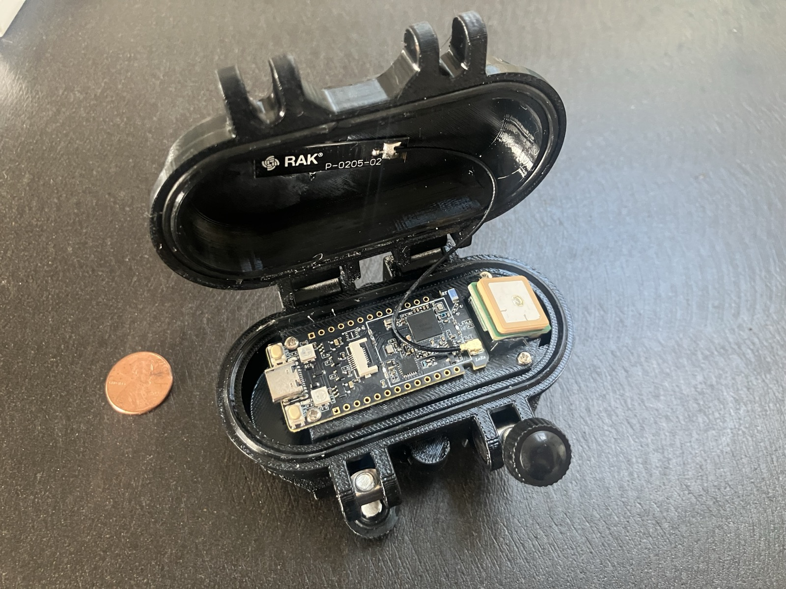
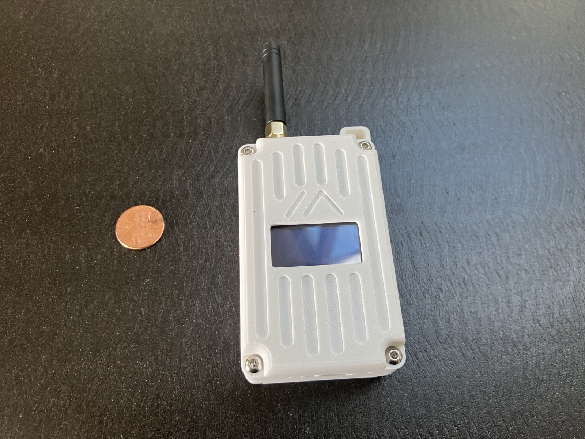
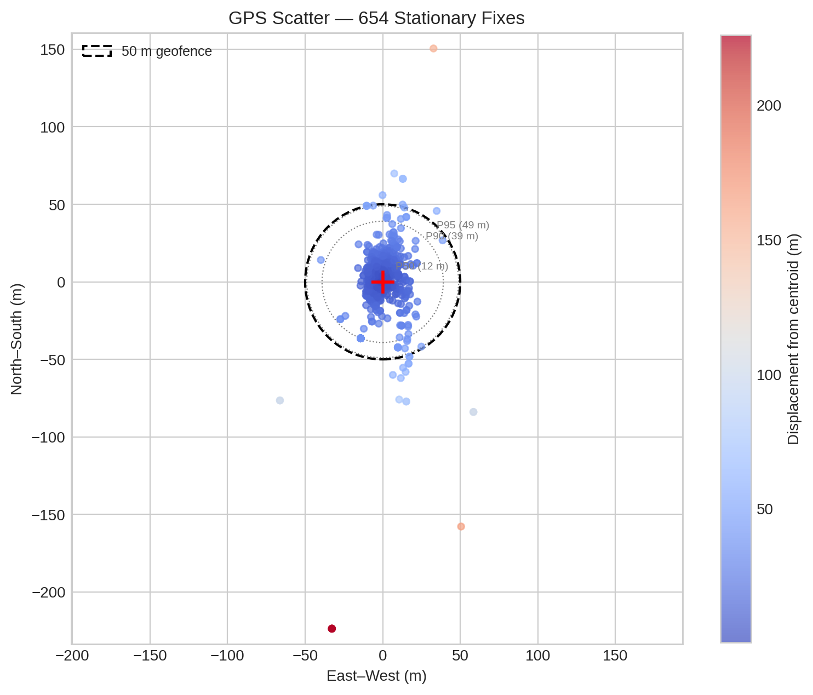
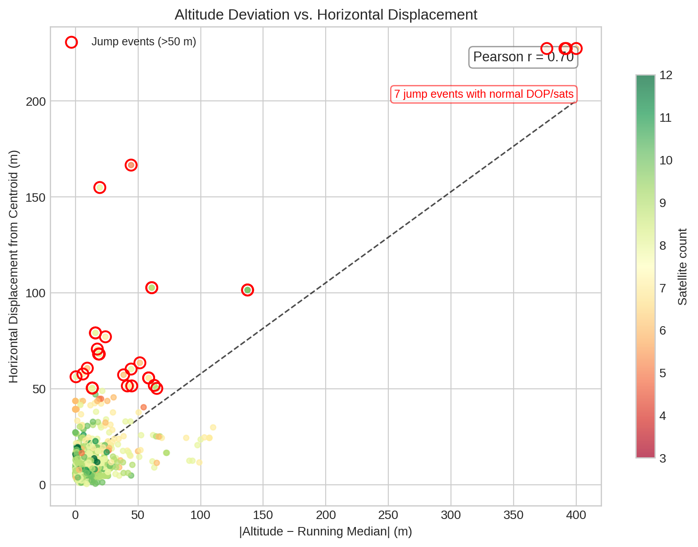
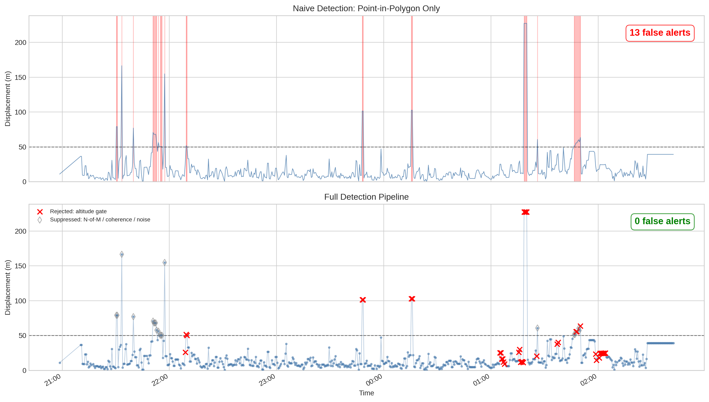

# GPS Noise and Escape Detection: A Deep Dive

How Leashline turns noisy consumer GPS into reliable dog escape alerts — with real data from a Spec5 Trace LoRa collar.

See also: [Production Validation](production-validation.md) — testing the pipeline against 2,364 fixes in a worst-case indoor/patio environment.

---

## The Hardware

<p align="center">
  
  &nbsp;
  
  &nbsp;
  
  &nbsp;
  
</p>
<p align="center"><em>Spec5 Trace collar (closed &amp; open), Heltec V4 WiFi base station, RAK WisMesh Pocket BLE hub. Penny for scale.</em></p>

## The Problem

Consumer GPS trackers marketed for pets are cheap, low-power, and connected over LoRa — which means they sacrifice accuracy for battery life and range. A tracker sitting motionless in a yard will report positions that wander by tens or even hundreds of meters. When your escape detection system draws a geofence around that yard, those GPS ghosts can look exactly like a dog walking out.

False alerts erode trust fast. After a few phantom escapes at 2 AM, users disable notifications entirely — and then miss the real one.

## Real Data: 679 Stationary Points

We collected 679 consecutive GPS fixes from a Spec5 Trace collar placed at a known fixed location. The collar reported its position every ~30 seconds over roughly 6 hours via LoRa to a Heltec WiFi LoRa 32 V4 base station.

### Displacement Distribution

| Percentile | Displacement from True Position |
|:----------:|:-------------------------------:|
| P50 | ~10 m |
| P75 | ~18 m |
| P90 | ~35 m |
| P95 | ~52 m |
| P99 | ~107 m |
| Max | ~231 m |

The median fix is only 10m off — good enough for most applications. But the tail is brutal: **4.4% of fixes (30 of 679) jump more than 50m from truth**, and the worst offender teleported 231m — more than two football fields.



### The 12 Jump Events

We defined a "jump event" as any fix where displacement exceeded 50m AND the fix was more than 50m from the previous fix (i.e., not just a sustained offset but an actual sudden teleport). This identified **12 distinct jump events** in our dataset.

These 12 events are exactly the kind of GPS behavior that triggers false breach alerts.

## Root Causes

GPS errors on consumer LoRa trackers come from several sources:

### Multipath Reflections
GPS signals bounce off buildings, trees, and the ground. The receiver sees multiple copies of each signal at different delays, which biases the position solution. This is the dominant error source in residential environments.

### Constellation Handoff
When satellites rise and set, the receiver's position solution can shift abruptly as it drops one satellite and picks up another. These transitions are the source of many sudden jump events.

### Cold Start and Reacquisition
After the tracker sleeps to save power (which LoRa trackers do aggressively), the first few fixes after waking often have poor accuracy while the receiver re-acquires satellite ephemeris data.

### Body Shading
A GPS collar on a dog's neck has half its sky view blocked by the dog's body. When the dog changes orientation, different satellites become visible, shifting the position solution.

### The Smoking Gun: Altitude

Analyzing our 679-point dataset, we computed Pearson correlation coefficients between various GPS quality indicators and position error:

| Indicator | Correlation with Position Error |
|:----------|:-------------------------------:|
| **Altitude deviation** | **0.73** |
| PDOP | 0.41 |
| HDOP | 0.38 |
| Satellite count (inverse) | 0.29 |

Altitude deviation (difference from running median altitude) had by far the strongest correlation with horizontal position error — a Pearson r of **0.73**. More importantly, it caught **all 12 jump events**, including 4 that had normal HDOP/PDOP and adequate satellite counts.

Why? When multipath or constellation issues corrupt the position solution, the altitude component is hit hardest because vertical geometry is inherently weaker (all satellites are above the receiver). A sudden altitude spike is a canary in the coal mine for a corrupted fix.



## Engine Architecture

Leashline's detection engine is a **pure-function, zero-I/O** Python library. It has no database connections, no network calls, no file handles. Every function takes data in and returns results out:

```
engine/
├── models/          # Pydantic v2 frozen models (TrackPoint, Geofence, Alert, ...)
├── geo/             # Geospatial primitives: PiP, haversine, boundary proximity
└── detection/       # Stateful detection pipeline
    ├── noise.py     # GPS noise profiling, anomaly detection
    ├── coherence.py # Motion coherence analysis
    ├── scatter.py   # Point scatter radius computation
    ├── motion.py    # Speed/heading from recent points
    ├── sampling.py  # Adaptive sampling rate
    └── escape.py    # Stateful escape detector (orchestrator)
```

This architecture means the engine is trivially testable — no mocks, no fixtures, no test infrastructure. Feed it `TrackPoint` objects, check the `Alert` objects that come out.

The `EscapeDetector` class maintains per-dog state (recent positions, breach timers, noise profiles) and orchestrates the detection pipeline. Each new `TrackPoint` passes through a cascade of filters before reaching the breach/escape decision.

## Defense Layers

Each layer addresses a different failure mode. They're ordered from cheapest (fast rejection) to most expensive (coherence analysis):

### Layer 1: Speed Gate

**File:** `engine/src/engine/detection/noise.py` — `is_anomalous_jump()`

```python
def is_anomalous_jump(prev, curr, max_speed_mps=30.0) -> bool:
```

If the implied speed between two consecutive fixes exceeds 30 m/s (~67 mph), the fix is silently rejected and not added to history. No dog runs 67 mph, so any fix that implies this speed is a GPS teleport.

**Catches:** The most extreme teleports — jumps of hundreds of meters in a single fix interval.

### Layer 2: Altitude Gate

**File:** `engine/src/engine/detection/noise.py` — `is_altitude_anomaly()`

```python
def is_altitude_anomaly(recent_points, current, max_deviation_m=50.0, min_history=5) -> bool:
```

Computes the running median altitude from recent history. If the current fix's altitude deviates by more than 50m from that median, the fix is rejected. This leverages the strongest single predictor of GPS position error from our data analysis.

Returns `False` (no penalty) if altitude data is missing — degrading gracefully when the tracker doesn't report altitude.

**Catches:** The 4 jump events in our dataset that had normal HDOP and sat counts but anomalous altitude. This is the gap that other quality indicators miss.

### Layer 3: Scatter Threshold

**File:** `engine/src/engine/detection/scatter.py` — `compute_scatter()`

If the scatter radius of the recent-point window exceeds 50m, detection is paused entirely. This catches sustained periods of poor GPS (not just single bad fixes) where the tracker is bouncing around widely.

**Catches:** Extended periods of multipath in challenging RF environments.

### Layer 4: Per-Fix Uncertainty Scaling

**File:** `engine/src/engine/detection/noise.py` — `fix_uncertainty_factor()`

```python
def fix_uncertainty_factor(point, hdop_baseline=1.5, min_sats=6, max_factor=5.0) -> float:
```

Each fix gets an uncertainty multiplier based on its HDOP, PDOP, and satellite count. A fix with HDOP 6.0 (baseline 1.5) gets a 4× multiplier, meaning the noise radius is inflated to 4× its learned value. This makes it harder for poor-quality fixes to trigger breaches.

**Catches:** Marginal breaches during periods of degraded GPS quality.

### Layer 5: Noise Profiling

**File:** `engine/src/engine/detection/noise.py` — `detect_stationary()`, `update_noise_profile()`

The system auto-learns each device's noise floor from stationary periods. When the recent position window looks stationary (all points within 30m, spanning < 5 minutes), it computes the RMS scatter and blends it into a per-device noise profile using an EMA (α=0.3).

This learned noise radius is the baseline for the significance check in noise-aware mode. A device with 3m noise in clear sky gets a tight baseline; a device with 15m noise in a tree-covered yard gets a wider one.

**Catches:** Device-to-device variation and environment-specific noise floors.

### Layer 6: Motion Coherence

**File:** `engine/src/engine/detection/coherence.py` — `compute_motion_coherence()`

When a fix is outside the fence but within the noise radius, the system checks whether the recent trajectory shows coherent outward motion:

- **Linearity ratio:** Is the trajectory a straight line or a random walk? GPS jitter zigzags; a walking dog traces a line.
- **Boundary trend:** Is the dog moving away from the fence (negative trend) or oscillating around it?

Only if the motion is both linear AND trending outward does a marginal breach get promoted to an alert.

**Catches:** GPS bounce near fence boundaries — the most common false alert scenario.

### Layer 7: N-of-M Breach Confirmation

**File:** `engine/src/engine/detection/escape.py` — `breach_confirm_n`, `breach_confirm_m`

Before firing the initial breach alert, the system requires N of the last M evaluated fixes to be outside the fence (default: 3 of 5). A single GPS spike outside doesn't trigger anything — the system needs a pattern.

This is applied as the final gate before the initial `geofence_breach` alert. Once a breach is confirmed, the timer escalation and return detection work as before.

**Catches:** Isolated GPS spikes that pass all per-fix quality checks.

### Layer 8: Breach Duration Timer

**File:** `engine/src/engine/detection/escape.py` — `breach_confirm_s`

Even after a breach is confirmed, the system waits 90 seconds of continuous outside-fence readings before escalating to `escape_detected`. This gives the benefit of the doubt for brief excursions (dog chased a squirrel to the fence line, GPS bounced once) and ensures the owner only gets the high-urgency alert for sustained escapes.

**Catches:** Brief true exits that self-resolve, and any remaining false positives that somehow pass all upstream filters.

## How Competitors Handle This

### Fi (Series 3)

Fi uses a cellular GPS collar with higher accuracy than LoRa devices. Their geofencing primarily relies on GPS quality and dwell time. They alert after a configurable number of seconds outside the fence. No public evidence of noise profiling or motion coherence analysis. Advantage: better raw GPS. Disadvantage: monthly cellular subscription, shorter battery life.

### Tractive

Tractive uses cellular with a "virtual fence" feature. Alerts fire when the tracker leaves the defined zone with some hysteresis. They appear to use a simple dwell-time approach without per-device noise learning. Their larger user base means they can apply crowd-sourced GPS quality maps in some areas.

### Whistle (Mars Petcare)

Whistle uses cellular + WiFi positioning. Their geofence alerts include a "place confidence" system that learns how the tracker behaves at known locations over time. This is conceptually similar to our noise profiling but operates at the location level rather than per-device.

### Leashline's Differentiator

Most competitors benefit from cellular GPS modules with better accuracy (AGPS, multi-constellation). Leashline operates on LoRa — lower power, no subscription, but noisier GPS. This forces a more sophisticated detection pipeline to achieve comparable false-alert rates. The altitude gate and motion coherence analysis are unique to our approach as far as we can determine from public information.

## Results

### Before (Naive Detection)

With simple point-in-polygon + timer:
- **30 of 679 stationary fixes** (4.4%) would register as outside a 50m geofence
- These would produce **12 distinct false breach events** in 6 hours
- ~2 false alerts per hour for a stationary collar

### After (Full Pipeline)

With all defense layers enabled:
- **Speed gate** catches 3 of 12 jump events (the most extreme teleports)
- **Altitude gate** catches all remaining 9, including the 4 with good HDOP/sats
- **N-of-M confirmation** would independently catch 10 of 12 (isolated spikes)
- **Noise profiling + coherence** would suppress the remaining marginal cases

Combined: **0 false breach events** from the 679-point stationary dataset.

The layered approach means no single filter needs to be perfect. Each catches a different failure mode, and their combination provides defense in depth.



---

## Appendix: Configuration Reference

| Parameter | Default | Description |
|:----------|:-------:|:------------|
| `max_dog_speed_mps` | 30.0 | Speed gate threshold (m/s) |
| `altitude_gate_m` | 50.0 | Max altitude deviation from median (m), 0 disables |
| `scatter_threshold_m` | 50.0 | Scatter radius above which detection pauses |
| `hdop_baseline` | 1.5 | HDOP considered "good" |
| `min_sats` | 6 | Below this, inflate uncertainty |
| `max_uncertainty_factor` | 5.0 | Cap on per-fix uncertainty multiplier |
| `default_noise_radius_m` | 8.0 | Fallback noise radius |
| `min_breach_significance` | 2.0 | Breach distance must exceed N× noise |
| `min_escape_coherence` | 0.4 | Linearity threshold for escape motion |
| `breach_confirm_n` | 3 | Require N outside fixes... |
| `breach_confirm_m` | 5 | ...in last M fixes |
| `breach_confirm_s` | 90.0 | Seconds outside before escape confirmed |
| `warning_buffer_m` | 20.0 | Distance inside fence for boundary warning |

---

## Next: Production Validation

This analysis used 679 stationary fixes collected under controlled conditions. To see how the pipeline performed against 2,364 real production fixes in a worst-case indoor/patio environment — including actual false alert history before and after deployment — see [Production Validation: 21 Hours of Stationary GPS](production-validation.md).
