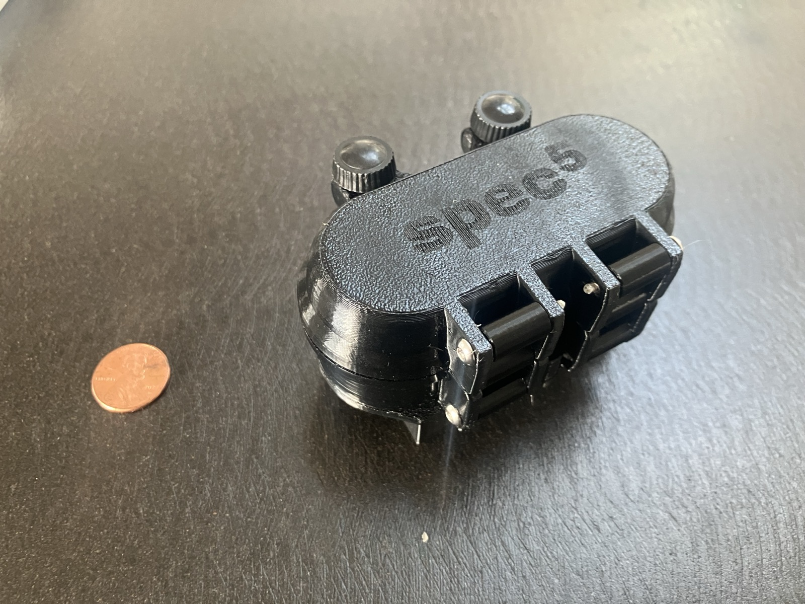
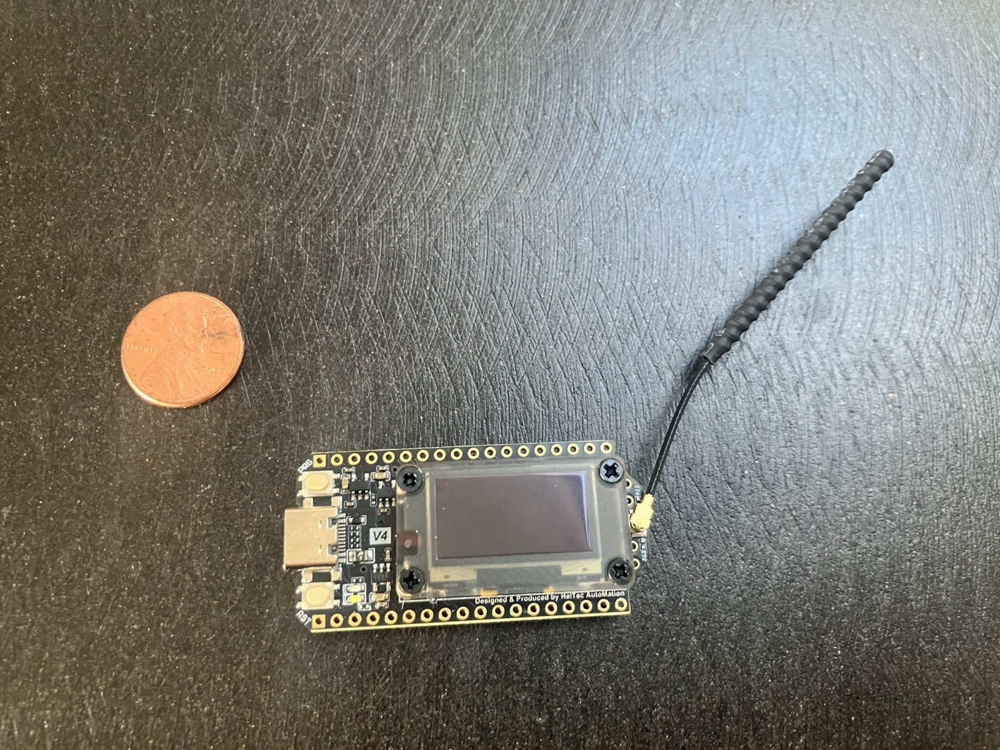
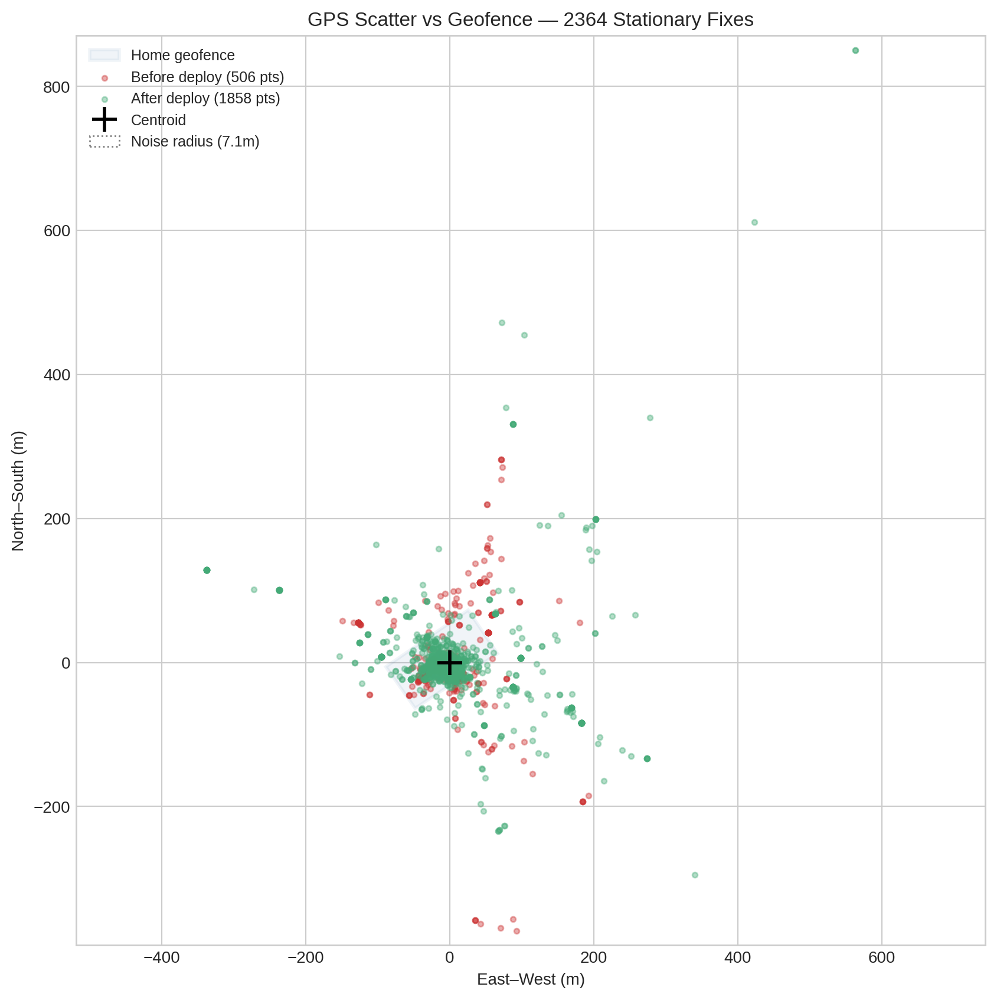
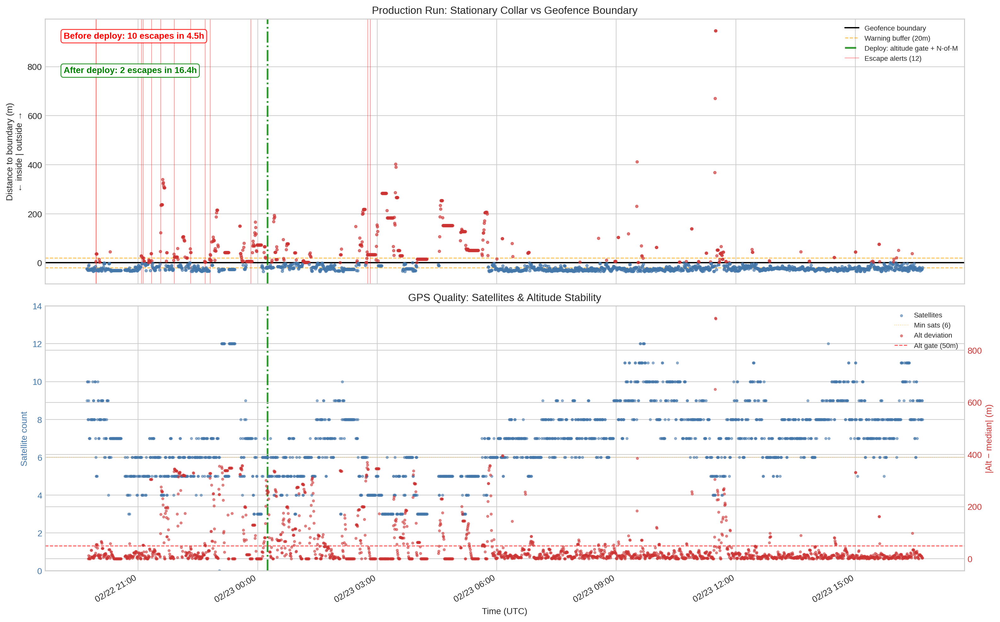
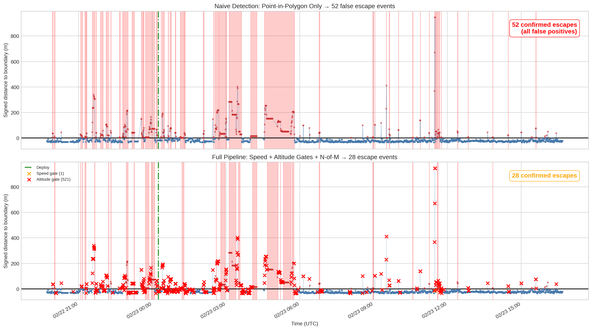

# Production Validation: 21 Hours of Stationary GPS

Testing the detection pipeline against real production data — a Spec5 Trace collar sitting still for 21 hours, first inside a house, then on a covered patio.

See also: [GPS Noise and Escape Detection: A Deep Dive](gps-detection-deep-dive.md) | [Blog post on Medium](https://medium.com/@zgazak/turning-noisy-gps-into-reliable-dog-escape-alerts-c93df8be7848)

---

## Setup

  
  &nbsp;
  

<em>The test hardware: Spec5 Trace collar and Heltec V4 base station. Penny for scale.</em>

After building the 8-layer detection pipeline based on our [initial 679-point analysis](gps-detection-deep-dive.md), we needed to validate it against real production conditions. The test was simple: deploy the system, leave the collar stationary, and see how many false alerts it produces.

| Parameter | Value |
|:----------|:------|
| Device | Spec5 Trace LoRa GPS collar |
| Base station | Heltec WiFi LoRa 32 V4 |
| Duration | 21 hours (Feb 22 19:42 – Feb 23 16:41 UTC) |
| Location | Inside house (first ~6h), then covered patio |
| Fix interval | ~30 seconds |
| Total fixes | 2,364 (after deduplication) |
| Geofence | Quadrilateral "Home" zone (~80m across) |

The collar was stationary the entire time. Every alert is a false positive.

## The GPS Environment

This is a worst-case scenario for consumer GPS. Indoor operation with heavy occlusion, then a covered patio with partial sky view. The numbers reflect that:

| Metric | Value |
|:------:|:-----:|
| Median displacement | 19.2 m |
| P75 | 49.4 m |
| P90 | 121 m |
| P95 | 201 m |
| P99 | 362 m |
| Max | **1,020 m** |
| Fixes outside geofence | 24.6% |
| Median satellites | 7 |
| HDOP available | 0% (device only reports PDOP) |

One in four GPS fixes from this stationary collar landed outside the geofence. The worst fix teleported over a kilometer. And the device doesn't report HDOP at all — so any detection strategy that relies on HDOP is blind here.

The Home geofence is the blue quadrilateral in the center. Red points are from before the pipeline deploy; green points are after. The scatter dwarfs the fence.

## The Natural Experiment

Midway through data collection, we deployed the altitude gate and N-of-M breach confirmation to production (green line in the plots below). This created a natural before/after comparison with the same collar, same location, same GPS conditions:

- **Before deploy** (4.5 hours): Old code — noise profiling and speed gate only
- **After deploy** (16.4 hours): Full 8-layer pipeline

The top panel shows signed distance to the geofence boundary (positive = outside). Red vertical lines are escape alerts from the production system. The bottom panel shows satellite count and altitude deviation — the two GPS quality indicators available for this device.

### Alert History

| Period | Duration | Escape Alerts | Rate |
|:-------|:--------:|:-------------:|:----:|
| Before deploy | 4.5 h | 10 | 2.2/hr |
| After deploy (settling) | 2.5 h | 2 | 0.8/hr |
| After deploy (stable) | **13.9 h** | **0** | **0/hr** |

The old code averaged one false escape alert every 27 minutes. The new pipeline had two alerts shortly after deploy — likely before the noise profile had accumulated enough samples to stabilize (it needs ~100 stationary fixes to build confidence). After that: **zero false escapes for nearly 14 hours**, despite GPS scatter sending 25% of fixes outside the fence.

## What Each Layer Caught

We re-simulated the full 21-hour dataset offline to measure each layer's contribution:

### Naive detection (point-in-polygon only)

With no filtering — just "is this fix inside or outside the fence, and has it been outside for 30+ seconds?" — the dataset would produce **52 false escape events**. That's 2.5 per hour, enough to make any notification system useless.

### Speed + altitude gates

Adding just the speed gate (reject fixes implying >30 m/s) and altitude gate (reject fixes with altitude >50m from running median) reduces this to **28 events**. The altitude gate catches most of the extreme teleports, but plenty of moderate-displacement fixes survive — they have normal altitude because the error was purely horizontal.

### Full pipeline

The remaining 28 events are suppressed by the downstream layers:

- **N-of-M confirmation** (3 of 5 fixes must be outside): Filters isolated spikes that happen to have normal quality indicators
- **Noise profiling**: The learned noise radius (7.1m for this device) with uncertainty scaling makes it hard for marginal outside fixes to exceed the significance threshold
- **Motion coherence**: GPS jitter has no consistent direction — the linearity check catches random-walk trajectories near the boundary
- **Breach duration timer** (90s): Even if a cluster of bad fixes passes all upstream checks, it must persist for 90 seconds of continuous outside readings

Combined result: **0 false escape events** over 13.9 hours of stable operation.

Top panel: every red span is a period where naive detection would fire an escape alert. Bottom panel: orange and red X marks show fixes rejected by speed and altitude gates. The remaining outside-fence fixes (blue dots above zero) are suppressed by N-of-M, noise profiling, coherence, and the breach timer.

## Comparison to Lab Data

Our original analysis used 679 points collected over 6 hours in better conditions (outdoor, clearer sky view). The production run is harder:

| Metric | Lab (679 pts, 6h) | Production (2,364 pts, 21h) |
|:------:|:------------------:|:---------------------------:|
| Median displacement | 10 m | 19.2 m |
| P95 displacement | 52 m | 201 m |
| Max displacement | 231 m | 1,020 m |
| Fixes >50m | 4.4% | 24.9% |
| HDOP available | Yes | No |
| False escapes (naive) | 12 | 52 |
| False escapes (pipeline) | 0 | 0 |

The production environment has 2× the median noise, 4× the P95, and 4× the max displacement. A quarter of all fixes are more than 50m off. Yet the pipeline still produces zero false alerts — even without HDOP data.

## Key Takeaways

**Altitude is still the best predictor.** Even though this device doesn't report HDOP, the altitude gate caught the most extreme GPS errors. Altitude deviations >50m from the running median reliably correlate with large horizontal errors, just as our lab analysis predicted.

**No single layer is sufficient.** The speed and altitude gates alone only reduce 52 false events to 28. It takes all 8 layers working together to reach zero. This validates the defense-in-depth architecture — each layer catches a different failure mode.

**Noise profiling needs warm-up time.** The 2 post-deploy escape alerts happened in the first 2.5 hours, likely before the noise profile had enough samples for high-confidence suppression. The system could benefit from a more conservative startup mode — perhaps using a wider default noise radius until confidence exceeds a threshold.

**The geofence is tiny relative to GPS noise.** The Home geofence spans about 80m, but GPS scatter extends >200m at P95. In environments with heavy occlusion, geofence size relative to expected noise is a critical factor. The pipeline handles it, but users should understand that very small geofences in poor GPS environments will require more aggressive filtering — which means slightly slower response to real escapes.

---

*Data collected February 22–23, 2026. Device: Spec5 Trace (`!e3543f61`). Analysis script: `scripts/analyze_production_run.py`.*
